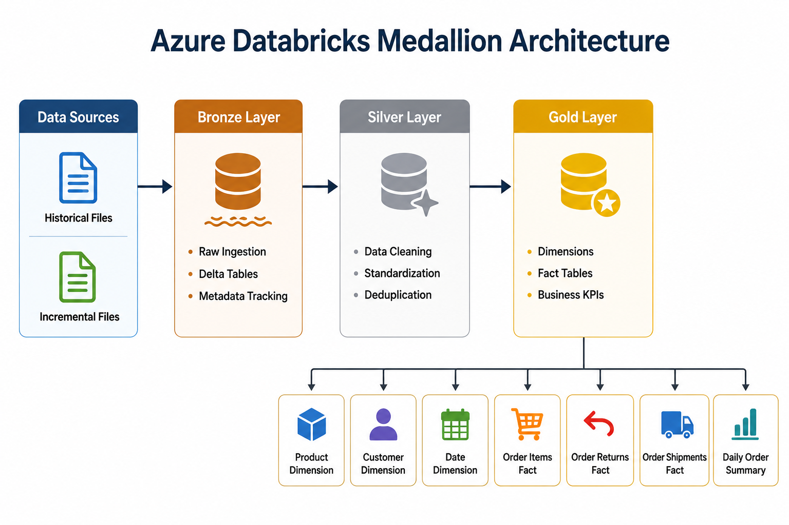
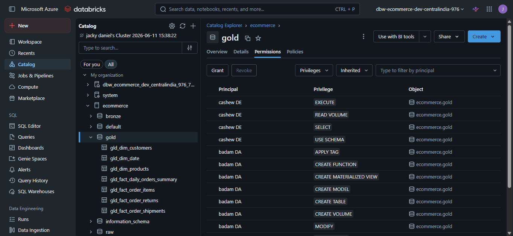

# Azure Databricks Retail Lakehouse

> An end-to-end Azure Databricks Lakehouse implementation that transforms raw e-commerce data into analytics-ready datasets using Medallion Architecture, Delta Lake, Auto Loader, Change Data Feed (CDF), and automated data pipelines.

---

## Project Overview

Retail organizations generate data from multiple operational systems including orders, products, customers, returns, and shipments. Without a centralized data platform, reporting teams often spend significant time collecting, cleaning, and preparing data before analysis can begin.

This project demonstrates the design and implementation of a modern Azure Databricks Lakehouse that ingests raw e-commerce datasets, processes them through Bronze, Silver, and Gold layers, and delivers business-ready datasets for reporting and analytics.

The solution incorporates incremental processing, automated orchestration, role-based access control, and Power BI reporting to simulate a real-world Data Engineering workflow.

---

## Solution Architecture

The following diagram provides a high-level view of the platform architecture.


---

## Business Problem

The fictional retail company lacked a dedicated Data Engineering platform and relied heavily on manual reporting processes.

Challenges included:

* Raw data distributed across multiple files
* Repetitive manual data preparation
* Slow report generation
* Inconsistent business metrics
* Difficulty processing growing transaction volumes

The objective was to build a scalable and automated data platform capable of supporting reliable business reporting.

---

## Technology Stack

| Category               | Technologies                             |
| ---------------------- | ---------------------------------------- |
| Cloud Platform         | Microsoft Azure                          |
| Storage                | Azure Data Lake Storage Gen2 (ADLS Gen2) |
| Processing             | Azure Databricks                         |
| Data Framework         | Apache Spark                             |
| Storage Format         | Delta Lake                               |
| Data Ingestion         | Auto Loader (CloudFiles)                 |
| Incremental Processing | Delta MERGE                              |
| Change Tracking        | Change Data Feed (CDF)                   |
| Governance             | Unity Catalog                            |
| Security               | Microsoft Entra ID                       |
| Visualization          | Power BI                                 |

---

## Dataset Overview

### Historical Full Load

Period:

```text
January 2024 → August 2025
```

Dimension Tables:

* Brands
* Categories
* Products
* Customers
* Calendar

Fact Tables:

* Order Items
* Order Returns
* Order Shipments

---

### Incremental Load

Period:

```text
August 2025 → December 2025
```

Fact Tables:

* Order Items
* Order Returns
* Order Shipments

The incremental files simulate ongoing business operations and are processed automatically through the pipeline.

---

## Data Storage Layer

Source datasets are stored in Azure Data Lake Storage Gen2.


The storage layer contains both historical and incremental datasets that serve as the source for the lakehouse ingestion process.

---

## Medallion Architecture

The project follows the Medallion Architecture pattern.



### Bronze Layer

Purpose:

* Raw data ingestion
* Metadata tracking
* Historical data preservation
* Schema evolution support

Key Features:

* Auto Loader
* Structured Streaming
* Delta Tables
* Checkpointing

---

### Silver Layer

Purpose:

* Data cleansing
* Standardization
* Deduplication
* Business rule validation

Key Features:

* Delta MERGE
* Data Quality Transformations
* Incremental Upserts

---

### Gold Layer

Purpose:

* Business-ready dimensions
* Analytics-ready fact tables
* KPI generation
* Reporting optimization

Gold Tables:

* Product Dimension
* Customer Dimension
* Date Dimension
* Order Items Fact
* Order Returns Fact
* Order Shipments Fact
* Daily Order Summary

---

## Data Flow

The following diagram illustrates how operational data is transformed into business insights.


---

## Data Model

### Dimensions

* Product Dimension
* Customer Dimension
* Date Dimension

### Fact Tables

* Order Items Fact
* Order Returns Fact
* Order Shipments Fact

### Aggregate Tables

* Daily Order Summary

---

## Incremental Processing

A key objective of this project was implementing efficient incremental data processing.

The solution uses:

* Auto Loader for file ingestion
* Delta MERGE for upsert operations
* Change Data Feed (CDF) for downstream processing
* Checkpointing for tracking processed files

This approach prevents unnecessary reprocessing of historical data and supports scalable pipeline execution.

---

## Pipeline Orchestration

Pipeline execution is automated using Databricks Jobs.


Configured workflows include:

### Daily Refresh

* Dimension Processing
* Order Items Processing
* Workflow Orchestration

Schedule:

```text
Daily at 2:00 AM
```

---

### Monthly Refresh

* Returns Processing
* Shipments Processing

Schedule:

```text
First day of every month at 2:00 AM
```

Additional capabilities:

* Job dependencies
* Automated scheduling
* Failure monitoring
* Email notifications

---

## Security and Governance

Role-based access control was implemented using Microsoft Entra ID groups and Unity Catalog permissions.

### User Groups


Configured groups:

* Data Engineers
* Data Analysts

---

### Schema Permissions



Access policies:

| Role          | Permission  |
| ------------- | ----------- |
| Data Analyst  | Data Reader |
| Data Engineer | Data Editor |

This configuration demonstrates basic governance and access management practices within the lakehouse environment.

---

## Catalog Organization

The catalog structure follows the Medallion Architecture design pattern.


Schemas:

* Bronze
* Silver
* Gold

This organization provides clear separation between ingestion, transformation, and business consumption layers.

---

## Dashboard

The final reporting layer was built using Power BI.


The dashboard consumes Gold layer datasets and provides visibility into:

* Sales Performance
* Product Insights
* Customer Analysis
* Returns Trends
* Shipment Analytics
* Daily Order Metrics

---

## Repository Structure

```text
Azure-Databricks-Retail-Lakehouse/
│
├── architecture/
├── dashboards/
├── notebooks/
├── screenshots/
└── README.md
```

---

## Key Features

* Medallion Architecture (Bronze → Silver → Gold)
* Azure Data Lake Storage Gen2 Integration
* Azure Databricks Processing Layer
* Delta Lake Storage Format
* Auto Loader Ingestion
* Change Data Feed (CDF)
* Delta MERGE Upserts
* Incremental Processing
* Automated Job Scheduling
* Unity Catalog Governance
* Role-Based Access Control
* Power BI Reporting Layer

---

## Key Learnings

Through this project I gained hands-on experience with:

* Designing and implementing a Lakehouse Architecture
* Building incremental data pipelines using Delta Lake
* Working with Auto Loader and Structured Streaming
* Implementing Change Data Feed (CDF)
* Using Delta MERGE for scalable upserts
* Configuring Databricks Jobs and workflow orchestration
* Managing permissions using Unity Catalog and Entra ID
* Preparing business-ready datasets for analytics platforms
* Applying Medallion Architecture in a real-world retail scenario

---

## Future Enhancements

Potential improvements include:

* CI/CD deployment pipelines
* Infrastructure as Code (Terraform)
* Data Quality Frameworks
* Monitoring and Alerting
* Multi-environment deployment (Dev/Test/Prod)
* Automated testing and validation

---

## 🤝 Let's Connect!

If you found this project interesting, I'd love to connect and chat about Data Engineering, Data Analytics, and Business Intelligence.

* **Explore More:** This is just one part of my journey. Check out my [📂 Full Portfolio](https://github.com/JacobDaniel-82) to see my projects.
* **Professional Network:** Let's stay in touch on [💼 LinkedIn](https://www.linkedin.com/in/jacobdanielr)
* **Get in Touch:** Have a question or suggestion? Reach out via [📧 Email](mailto:jacobdanielr82@gmail.com)

*Designed and Engineered by **Jacob Daniel R** | 2026*
