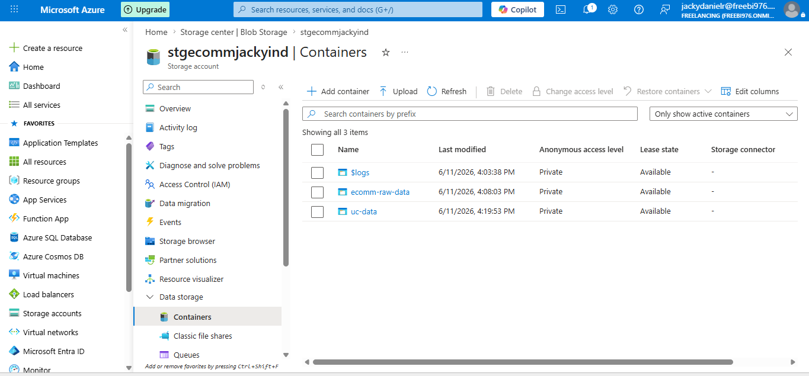
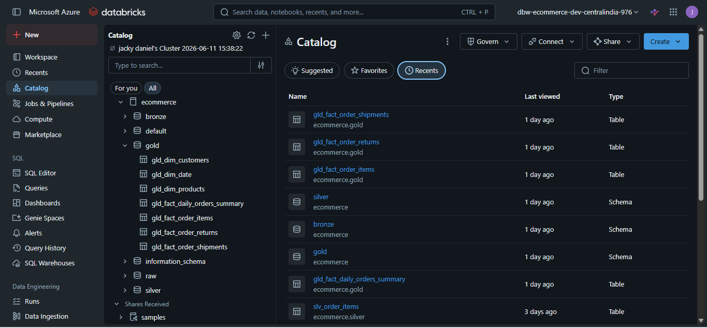
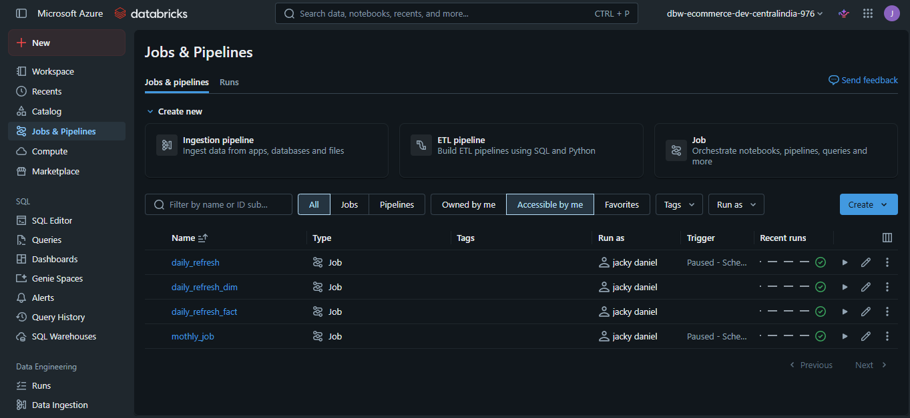
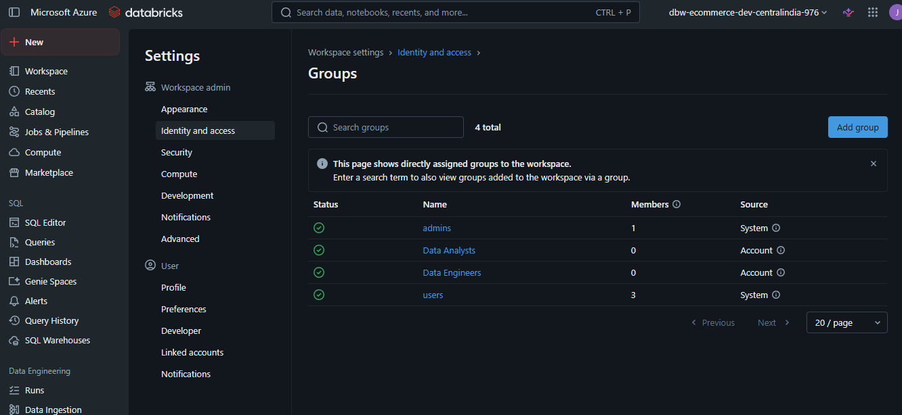
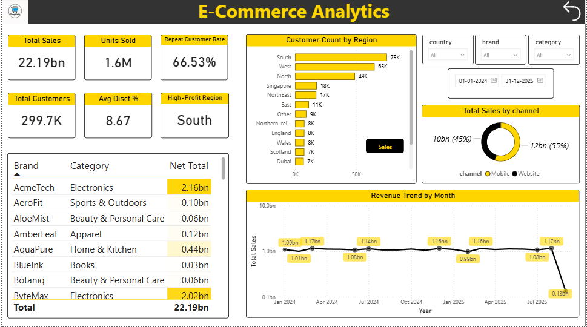

# Screenshots

This folder contains screenshots demonstrating the key components of the Azure Databricks Retail Lakehouse implementation.

The screenshots provide visual evidence of the platform architecture, security configuration, orchestration setup, storage organization, and reporting layer.

---

## adls_structure.png

Shows the Azure Data Lake Storage Gen2 (ADLS Gen2) directory structure used as the source layer for the project.

Contents include:

* Historical Load files
* Incremental Load files
* Dimension datasets
* Fact datasets

This storage layer serves as the landing zone for all source data processed by the lakehouse.

---

## catalog_structure.png

Displays the Databricks catalog and schema organization.

The screenshot highlights the Medallion Architecture implementation:

* Bronze Schema
* Silver Schema
* Gold Schema

It also shows the Delta tables created throughout the pipeline.

---

## jobs_pipelines.png

Shows the Databricks Jobs and Pipelines workspace.

The project includes automated workflows for:

* Daily Dimension Refresh
* Daily Fact Refresh
* Daily Orchestration Workflow
* Monthly Returns and Shipments Refresh

These jobs support scheduled and repeatable data processing.

---

## user_groups.png

Displays the Identity and Access Management (IAM) group configuration.

Groups were created to simulate role-based access control (RBAC) for different user personas, including:

* Data Engineers
* Data Analysts

This demonstrates basic governance and user management practices within the platform.

---

## user_access.png

Shows schema-level permissions assigned to user groups.

Examples include:

* Data Reader permissions for Data Analysts
* Data Editor permissions for Data Engineers

This configuration ensures controlled access to curated datasets while supporting secure collaboration.

---

## dashboard.png

Displays the Power BI dashboard built on top of the Gold layer tables.

The dashboard consumes analytics-ready datasets generated by the lakehouse and provides business reporting capabilities for retail operations.

---

## Purpose

Together, these screenshots demonstrate the complete lifecycle of the project:

1. Data Storage (ADLS Gen2)
2. Data Processing (Databricks)
3. Data Organization (Medallion Architecture)
4. Workflow Automation (Jobs & Pipelines)
5. Security & Governance (RBAC)
6. Business Consumption (Power BI)
